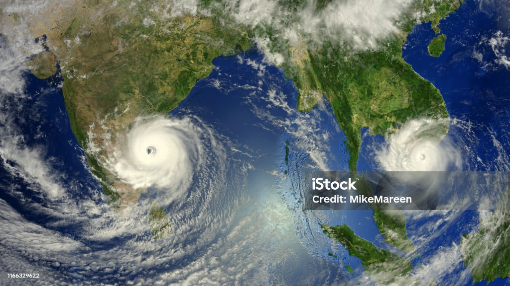

# Global Weather Explorer and Vacation Mapper

## Project Overview

#### This repository combines two projects:
	1.	Weather Analysis: Explore weather data from over 500 cities to uncover global weather patterns, 
      such as temperature, humidity, wind speed, and cloudiness, using the OpenWeatherMap API.
	2.	Vacation Planner: Plan vacations by identifying ideal destinations based on weather conditions, 
      finding nearby hotels using the Geoapify API, and creating interactive maps.
      
      
#### Tools and Libraries
	•	Python, Jupyter Notebook, Pandas, Matplotlib, geoViews, citipy
	•	OpenWeatherMap API and Geoapify API

#### Features

	•	Analyze global weather patterns for a diverse range of cities.
	•	Filter destinations based on ideal vacation weather.
	•	Generate interactive maps highlighting vacation cities and nearby hotels.

#### How to Use

	1.	Clone the repository
	2.	Obtain API keys for OpenWeatherMap and Geoapify.
	3.	Run the WeatherPy.ipynb and VacationPy.ipynb notebooks to analyze data and generate maps.
